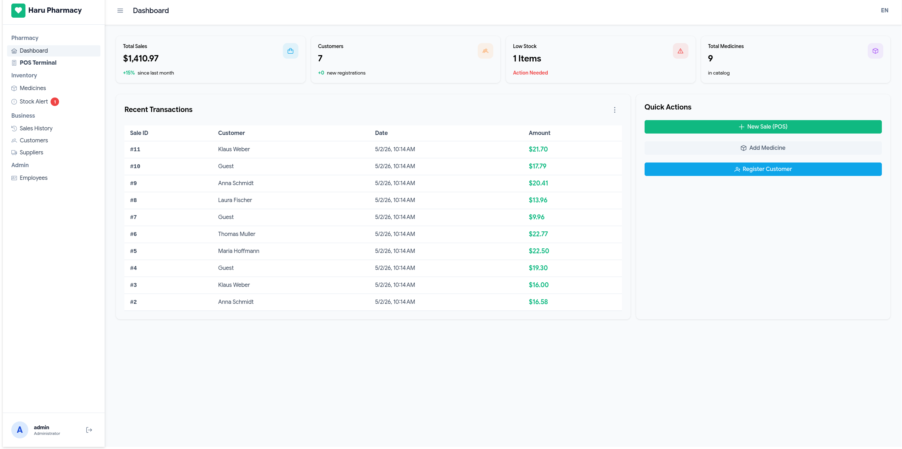
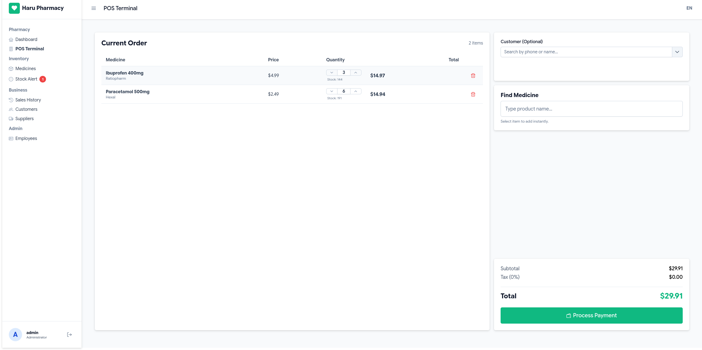
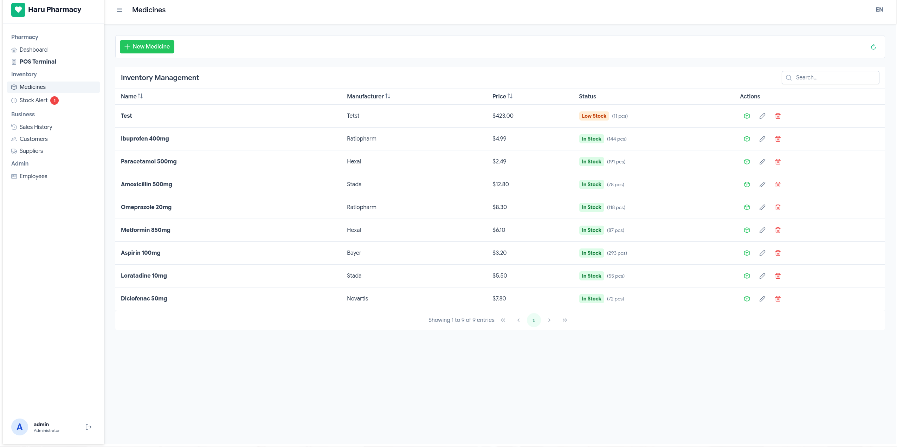
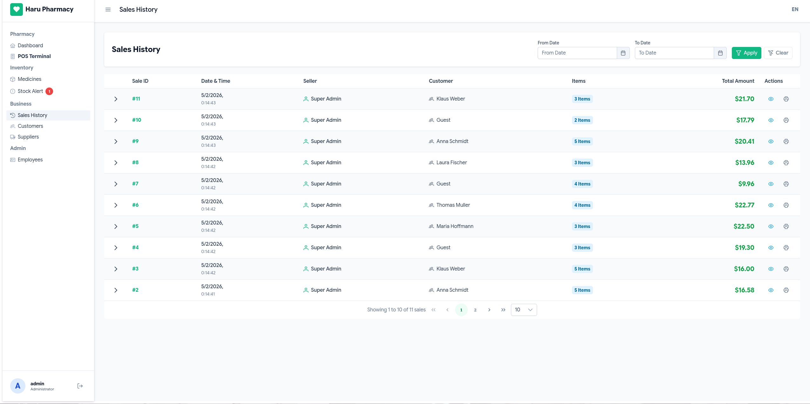

# Pharmacy Management System

[](https://spring.io/projects/spring-boot)
[](https://angular.io/)
[-orange?style=for-the-badge&logo=openjdk&logoColor=white)](https://openjdk.org/)
[](https://www.typescriptlang.org/)
[](https://www.docker.com/)
[](https://github.com/Kitty-Hivens/Pharmacy/actions)
[](https://pharmacy.hivens.dev)
[](LICENSE)

Point of sale and inventory management for a pharmacy: batch tracking with
expiry dates, FEFO stock rotation, sales, customers, suppliers and reporting.
Spring Boot 4 backend, Angular 21 frontend, MariaDB.

Live instance: [pharmacy.hivens.dev](https://pharmacy.hivens.dev)

---

## Screenshots

| Dashboard                                    | POS Terminal                     |
|----------------------------------------------|----------------------------------|
|  |  |

| Inventory Management                         | Sales History                        |
|----------------------------------------------|--------------------------------------|
|  |  |

---

## Features

### Point of sale

- Server-side stock validation, so a sale cannot oversell a batch
- Customer discounts applied during price calculation
- Print-ready receipt for each transaction
- Cart kept in LocalStorage, so a reload does not lose the sale in progress

### Inventory

- FEFO batch rotation (first expired, first out)
- Batch tracking with expiration dates
- Low-stock alerts
- Supplier records linked to incoming stock

### Reporting

- Revenue over time with growth figures
- Customer registration trends
- Stock status overview
- Paginated sales history with date filtering

### Security

- JWT authentication, stateless
- Role-based access control: admin and pharmacist
- BCrypt password hashing via Spring Security
- Explicit CORS allow-list

### Frontend

- Angular 21 running zoneless, reactivity through signals
- PrimeNG component library
- TypeScript API client generated from the OpenAPI spec
- Responsive layout with PrimeFlex
- Interface in English and Russian, switchable at runtime

---

## Stack

### Backend

```
Spring Boot 4.0.1      virtual threads, structured logging
Java 21 (LTS)          records, pattern matching, sequenced collections
Spring Data JPA        Hibernate
Spring Security 7      JWT and RBAC
Flyway 10+             versioned schema migrations
MapStruct 1.5.5        compile-time DTO mapping
SpringDoc OpenAPI 2.7  spec generation
MariaDB 10.11
JUnit 5 + Mockito
```

### Frontend

```
Angular 21.2.5         zoneless change detection, signals
PrimeNG 21.1.3
RxJS 7.8
OpenAPI Generator      generated TypeScript client
ngx-translate          i18n
TypeScript 5.9         strict mode
```

### Infrastructure

```
Docker Compose         multi-container orchestration
GitHub Actions         deploy on push
Nginx + Let's Encrypt  reverse proxy, HTTPS
Gradle 8.14
npm 11.7.0
```

---

## Architecture decisions

### Contract-first API

The OpenAPI specification is the single source of truth rather than hand-synced
types on both sides. Type mismatches surface at build time instead of runtime,
and the frontend client is regenerated rather than maintained.

```bash
# Backend exposes /v3/api-docs
# Frontend regenerates its client:
npm run generate-api
```

### FEFO inventory

Pharmaceutical stock must be sold closest-to-expiry first, so batch selection is
ordered by expiration date and skips anything already expired.

```sql
SELECT * FROM inventory
WHERE medicine_id = :id
  AND stock_quantity > 0
  AND expiration_date >= CURRENT_DATE
ORDER BY expiration_date ASC
```

The sale itself is one transaction: fetch the valid batches, check the total
covers the requested quantity, then deduct oldest first.

```java
@Transactional
public void createSale(SaleCreateDto dto, String username) {
    List<Inventory> batches = inventoryRepo.findValidBatchesForSale(medicineId, LocalDate.now());

    int totalStock = batches.stream().mapToInt(Inventory::getStockQuantity).sum();
    if (totalStock < requestedQty) throw new InsufficientStockException();

    for (Inventory batch : batches) {
        // deducted oldest first; @Version guards the concurrent case
    }
}
```

### Optimistic locking

Two terminals can sell the same medicine at the same moment. Hibernate's
`@Version` makes the second write fail rather than silently overwrite the first.

```java
@Entity
public class Inventory {
    @Version
    private Long version;
}
```

The losing transaction gets `OptimisticLockingFailureException` and retries
against the current stock level.

### DTO projection queries

Listing medicines with their stock totals is one query, not one per medicine.

```java
@Query("""
    SELECT new MedicineResponseDto(
        m.id, m.name, m.price,
        COALESCE(SUM(i.stockQuantity), 0L)
    )
    FROM Medicine m
    LEFT JOIN Inventory i ON i.medicine.id = m.id
    GROUP BY m.id
""")
List<MedicineResponseDto> findAllSummarized();
```

### Flyway migrations

Schema changes are versioned files, so dev, test and production converge on the
same structure.

```
backend/src/main/resources/db/migration/
├── V1__init_schema.sql
├── V2__add_version_column.sql
└── V3__create_indexes.sql
```

---

## Getting started

### Prerequisites

```
Java 21 JDK       https://adoptium.net/
Node.js 22+       https://nodejs.org/
Docker Compose    https://www.docker.com/
```

### Docker

```bash
git clone https://github.com/Kitty-Hivens/Pharmacy.git
cd Pharmacy
docker-compose up -d
```

| Service  | Address                               |
|----------|---------------------------------------|
| Frontend | http://localhost                      |
| API docs | http://localhost:8080/swagger-ui.html |
| Database | localhost:3307                        |

The initial admin password comes from `ADMIN_INITIAL_PASSWORD`; the account is
`admin`.

### Local development

```bash
# Terminal 1: database
docker-compose up -d db

# Terminal 2: backend
cd backend
./gradlew bootRun

# Terminal 3: frontend
cd frontend
npm install
ng serve
```

Docker serves on `http://localhost`, `ng serve` on `http://localhost:4200`.

### Regenerating the API client

After changing backend DTOs or controllers:

```bash
cd frontend
npm run generate-api
```

---

## Project structure

```
pharmacy-management/
├── backend/                    # Spring Boot 4
│   ├── src/main/java/
│   │   └── haru/pharmacy/
│   │       ├── config/         # security, OpenAPI, CORS
│   │       ├── controller/     # REST endpoints
│   │       ├── dto/            # request and response objects
│   │       ├── exception/
│   │       ├── mapper/         # MapStruct interfaces
│   │       ├── model/          # JPA entities
│   │       ├── repository/     # Spring Data repositories
│   │       └── service/        # business logic
│   ├── src/main/resources/
│   │   ├── db/migration/       # Flyway
│   │   ├── messages.properties
│   │   └── messages_ru.properties
│   └── src/test/java/
│
├── frontend/                   # Angular 21
│   ├── src/app/
│   │   ├── api/                # generated OpenAPI client
│   │   ├── core/               # guards, interceptors
│   │   ├── layout/
│   │   └── pages/
│   │       ├── dashboard/
│   │       ├── pos/
│   │       ├── medicines/
│   │       ├── inventory/
│   │       ├── sales-history/
│   │       ├── customers/
│   │       ├── suppliers/
│   │       └── users/
│   └── public/i18n/
│
├── .github/workflows/
│   └── deploy.yml
└── docker-compose.yml
```

---

## API

Interactive reference: `https://pharmacy.hivens.dev/swagger-ui.html`

```http
POST /auth/login                Authenticate
GET  /api/medicines             List medicines
POST /api/inventory/restock     Add stock (admin only)
POST /api/sales                 Process a sale
GET  /api/sales?from=&to=       Sales history, filtered
POST /api/customers             Register a customer
GET  /api/users                 List employees (admin only)
```

Authentication is a bearer token from `/auth/login`:

```javascript
POST /auth/login
{ "username": "admin", "password": "..." }
// { "token": "eyJhbGc...", "role": "ADMIN" }

GET /api/medicines
Authorization: Bearer eyJhbGc...
```

---

## Testing

```bash
cd backend
./gradlew test

./gradlew test jacocoTestReport
# build/reports/jacoco/test/html/index.html
```

Covered: medicine CRUD, FEFO batch selection, insufficient-stock paths,
optimistic-lock conflicts, authentication and authorization.

End-to-end tests run under Playwright:

```bash
cd frontend
npm run test:e2e
```

---

## Deployment

### Production build

```bash
cd backend
./gradlew bootJar          # build/libs/

cd frontend
npm run build              # dist/frontend/browser/
```

### Environment

```bash
# backend
DB_URL=jdbc:mariadb://db:3306/pharmacy_db
DB_USERNAME=
DB_PASSWORD=
JWT_SECRET=
APP_CORS_ALLOWED_ORIGINS=https://yourdomain.com
ADMIN_INITIAL_PASSWORD=

# frontend, environment.prod.ts
apiUrl=https://api.yourdomain.com
```

### CI/CD

Every push to `Central-Workflow` deploys:

```yaml
# .github/workflows/deploy.yml
on:
  push:
    branches: [Central-Workflow]
jobs:
  deploy:
    runs-on: ubuntu-latest
    steps:
      - uses: appleboy/ssh-action@v1
        with:
          script: |
            cd /root/Pharmacy
            git pull
            docker compose up --build -d
```

---

## Contributing

Fork, branch, commit, open a pull request.

---

## Contact

- GitHub: [@Kitty-Hivens](https://github.com/Kitty-Hivens)
- Email: vitalii.vakar@proton.me
- LinkedIn: [Vitalii Vakar](https://linkedin.com/in/vitalii-vakar)

---

## License

MIT. See [LICENSE](LICENSE).
